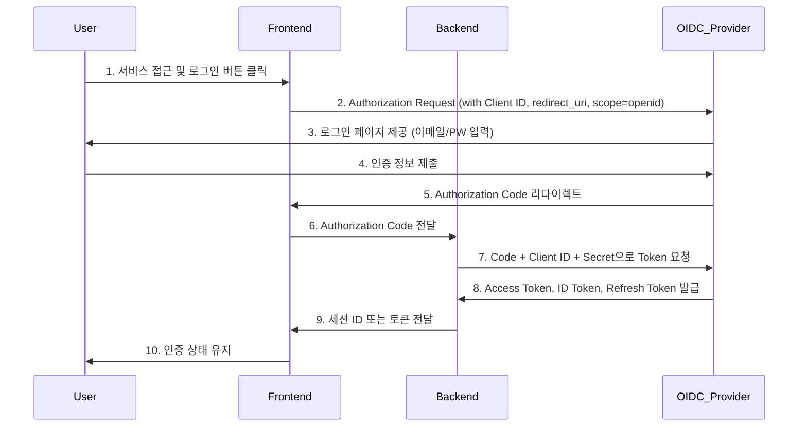

> 배경

간편 인증 로그인 흐름 자세히 알아보기

## 🔍 Research

### 주요 키워드

-  **OpenID Connect (OIDC)**: OAuth 2.0 기반의 인증 프로토콜
-  **ID Token**: 사용자 인증 정보를 포함한 JWT
-  **Authentication**: 사용자 식별 및 정보 전달 과정
-  **Client (Relying Party)**: 사용자 정보에 접근하려는 애플리케이션
-  **OpenID Provider (OP) / Identity Provider (IDP)**: 인증 서비스를 제공하는 엔티티 (구글, 카카오 등)
-  **Access Token**: 리소스 접근 권한을 나타내는 토큰
-  **Scope**: 요청하는 권한의 범위 (예: openid, profile, email)
-  **Authorization Code**: 액세스 토큰과 ID 토큰을 얻기 위한 임시 코드
-  **Endpoints**: 인증 및 토큰 발급을 위한 OIDC 서버의 URL들 (예: /authorize, /token)


## **OIDC 인증 흐름 다이어그램**



1. 유저 → 프론트엔드: 서비스 접근 및 로그인 버튼 클릭 
2. 프론트엔드 → OIDC Provider: Authorization Request (with Client ID, redirect_uri, scope=openid)
3. OIDC Provider → 유저: 로그인 페이지 제공 (이메일/PW 입력)  
4. 유저 → OIDC Provider: 인증 정보 제출   
5. OIDC Provider → 프론트엔드: Authorization Code 리다이렉트   
6. 프론트엔드 → 백엔드: Authorization Code 전달   
7. 백엔드 → OIDC Provider: Code + Client ID + Client Secret으로 Token 요청   
8. OIDC Provider → 백엔드: Access Token, ID Token, Refresh Token 발급   
9. 백엔드 → 프론트엔드: 세션 ID 또는 토큰 전달 
10. 프론트엔드 → 유저: 인증 상태 유지


### 2. 프론트 -> OP (Authorization Request)

#### 프론트엔드에서 로그인 버튼 클릭 
- 프론트엔드는 구글의 **OAuth 2.0** 또는 **OpenID Connect** 인증 서버로 **Authorization Request**를 보냄.
- 이는 **API 요청**이 아니라 브라우저를 사용한 리다이렉트 요청입니다.
  (구체적으로는 **URL**을 만들고, 해당 URL로 사용자의 브라우저를 리다이렉트하는 방식)

- **Authorization Request URL**: 프론트엔드는 아래와 같은 URL을 생성하여 구글에 요청
```js
 https://accounts.google.com/o/oauth2/v2/auth?
  client_id=YOUR_CLIENT_ID&
  redirect_uri=YOUR_REDIRECT_URI&
  response_type=code&
  scope=openid%20profile%20email
  
```

- **client_id**: 구글 API 콘솔에서 발급받은 **클라이언트 ID**.
- **redirect_uri**: 사용자가 인증을 완료한 후 구글이 리다이렉트할 주소 (프론트엔드나 백엔드의 URI).
- **response_type=code**: 구글이 인증 후 **Authorization Code**를 반환하도록 요청.
- **scope**: 어떤 권한을 요청할지 지정 (예: `openid`, `profile`, `email` 등).
- **사용자 로그인**: 사용자가 구글 로그인 페이지에서 자신의 계정으로 로그인하면, 구글은 해당 사용자에게 **Authorization Code**를 발급하고, 이를 **redirect_uri**로 리다이렉트합니다.
- **리다이렉션**: 구글이 인증 후 프론트엔드를 지정한 **redirect_uri**로 리다이렉트하면, URL에 **Authorization Code**가 포함되어 전달됩니다. 

- 예를 들어:

```arduino

https://your-frontend-app.com/callback?code=AUTHORIZATION_CODE

```

애플리케이션은 **ID Token**을 사용하여 사용자가 누구인지 확인하고, **Access Token**을 사용하여 필요한 리소스를 API에서 요청할 수 있음.


### 🚩 알게된 것

-

### ⏭ 다음 단계 (What's Next?)

- [김용환 블로그 - OpenId Connect ](https://yonghwankim-dev.tistory.com/604)

### 📚 References & Resources

### 📝 연관 노트

- 🌿 **Budding:** [[]]
- 🌳 **Evergreen:** [[]]
