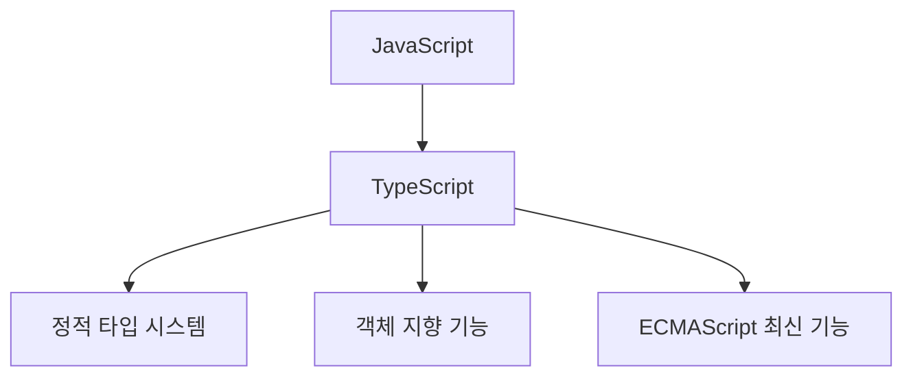
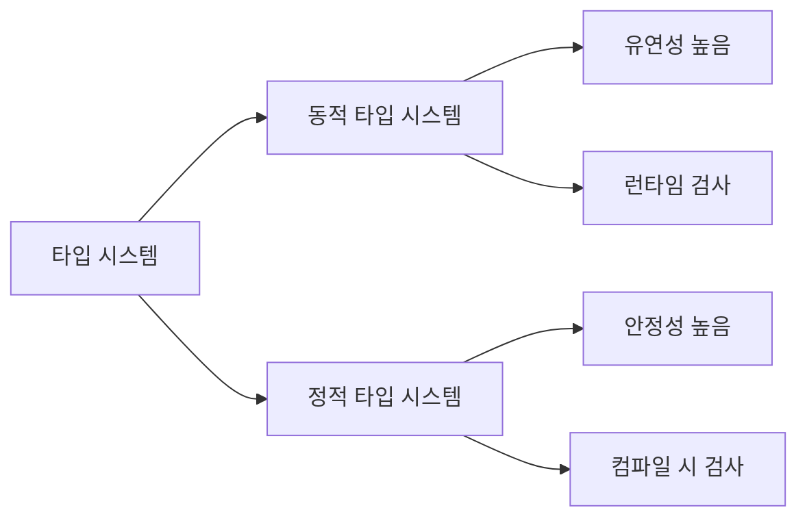
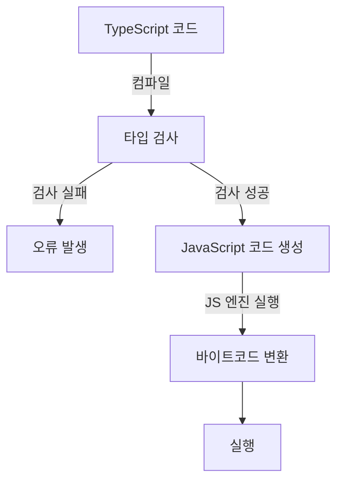
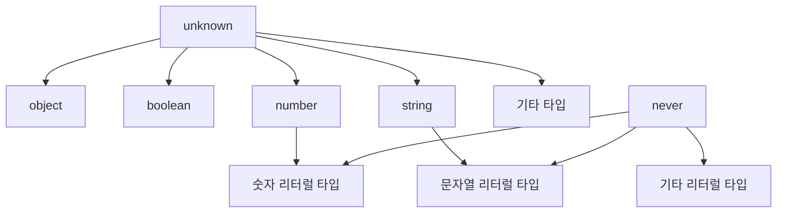

# 타입스크립트 이븐하게 살펴보기

> 이정환 강사님의 타입스크립트 특강 정리

## 이 노트의 핵심 키워드

- 점진적 타입 시스템 (Gradual Type System)
- 타입 추론 (Type Inference)
- 타입 호환성 (Type Compatibility)
- 업캐스팅과 다운캐스팅
- 특수 타입 (Unknown, Never, Any)
- TS 컴파일 과정
- 타입과 집합의 관계

### 1. 타입스크립트 소개

- 타입스크립트는 마이크로소프트에서 개발한 오픈 소스 프로그래밍 언어로, 자바스크립트의 상위 집합(Superset).
- 즉, 모든 자바스크립트 코드는 타입스크립트 코드이기도 하지만, 타입스크립트는 자바스크립트에 정적 타입 시스템을 추가한것.



### 2. 타입 시스템 개념

타입 시스템은 프로그래밍 언어에서 타입과 관련된 문법 체계를 의미합니다. 다음 세 가지 핵심 질문으로 구분할 수 있음:

1. **어떤 기준으로 타입을 결정하는가?**
2. **타입 검사는 언제 실행되는가?**
3. **타입 검사는 어떤 방식으로 진행되는가?**

### 3. 동적 타입 시스템 vs 정적 타입 시스템

#### 3.1 동적 타입 시스템 (Python, JavaScript)

- **특징**: 정적 타입 시스템보다 훨씬 더 유연함
- **타입 검사 시점**: 런타임 (실행 중에 타입 결정)
- **컴파일 시 타입 검사**: ❌
- **장점**: 매우 자유로움, 타입 관련 코드를 작성할 필요 없음
- **단점**: 프로그램 실행 전에 타입 오류 감지 불가능, 안정성 떨어짐

```javascript
// 동적 타입 시스템 예시 (JavaScript)
let x = 10 // 숫자
x = "Hello" // 문자열로 변경 가능
x = { id: 1 } // 객체로도 변경 가능
```

#### 3.2 정적 타입 시스템 (Java, C)

- **특징**: 매우 엄격하고 견고한 타입 시스템
- **타입 검사 시점**: 컴파일 타임
- **변수 타입 정의**: 명시적으로 정의 필요
- **장점**: 매우 견고함, 대부분의 오류는 컴파일 시점에 파악 가능
- **단점**: 자유롭지 못함, 타이핑 양이 많아짐

```java
// 정적 타입 시스템 예시 (Java)
int x = 10;      // 숫자로 선언
x = "Hello";     // 컴파일 오류 발생!
```

#### 3.3 두 시스템 비교



### 4. TypeScript: 점진적 타입 시스템

TypeScript는 두 타입 시스템의 장점만 추린 **점진적 타입 시스템(Gradual Type System)**!

- **장점 1**: 매우 자유롭게 코딩 가능
- **장점 2**: 컴파일 타임에 타입 검사로 안정성 확보
- **타입 선언 방식**: 직접 선언 또는 자동 추론 가능

```typescript
// 타입 직접 선언
let age: number = 30

// 타입 추론
let name = "John" // string으로 자동 추론

// 복잡한 타입도 정의 가능
type User = {
  id: number
  name: string
  isActive: boolean
}

const user: User = {
  id: 1,
  name: "Alice",
  isActive: true,
}
```

**TypeScript는 타입 추론(Type Inference) 기능을 통해 명시적으로 타입을 선언하지 않아도 코드 맥락에서 적절한 타입을 자동으로 추론**ㄴ

### 5. TypeScript 컴파일 과정

TypeScript가 실행되는 과정



1. **컴파일**: TypeScript 컴파일러가 타입 검사를 수행
2. **타입 오류 발견 시**: 타입 검사 실패로 컴파일 중지
3. **타입 검사 성공 시**: JavaScript 코드로 변환
4. **JavaScript 실행**: 변환된 코드는 JS 엔진에서 실행

TypeScript의 주요 목적은 JavaScript에 타입 검사 안전장치를 추가하는 것으로 타입 검사가 통과한 코드만 JavaScript로 변환되어 실행되므로, 런타임 오류를 크게 줄일 수 있다.

### 6. TypeScript의 모든 타입은 결국 '집합'이다

TypeScript를 학습하며 꼭 마주치게 되는 중요 개념들:

- 특수 타입 (Any, Never, Unknown)
- 타입 호환성 (Type Compatibility)

#### 6.1 집합(Set)의 관점에서 타입 이해하기

타입을 집합의 관점에서 해석하면, 각 타입은 특정 조건을 만족하는 값들의 집합이라고 볼 수 있다.

- **리터럴 타입**: 하나의 값만 포함하는 타입 (예: `1`, `"hello"`)
- **기본 타입**: 특정 종류의 여러 값을 포함하는 타입 (예: `number`, `string`)

```typescript
// 리터럴 타입
let one: 1 = 1
let greeting: "hello" = "hello"

// 기본 타입
let count: number = 42
let message: string = "TypeScript"
```

#### 6.2 타입 계층 구조

TypeScript의 타입들은 포함 관계에 따른 계층 구조를 형성:



- **슈퍼타입(Supertype)**: 더 넓은 범위의 값을 포함하는 타입 (예: `number`)
- **서브타입(Subtype)**: 더 좁은 범위의 값을 포함하는 타입 (예: 숫자 리터럴 `1`)

예를 들어, Number 타입은 모든 Number 리터럴 타입의 슈퍼타입이다.

#### 6.3 타입 호환성(Type Compatibility)

타입 호환성은 타입 간의 호환 여부를 판단하는 기준으로 TypeScript에서는 타입 계층 구조에 기반하여 판단한다.

- **업캐스팅(Upcasting)**: 서브타입에서 슈퍼타입으로의 변환 (안전하여 허용)
- **다운캐스팅(Downcasting)**: 슈퍼타입에서 서브타입으로의 변환 (안전하지 않아 기본적으로 금지)

```typescript
let a: number = 999
let b: 1 = 1

// 업캐스팅: 서브타입(1)에서 슈퍼타입(number)으로 - 안전하므로 허용
a = b // 가능

// 다운캐스팅: 슈퍼타입(number)에서 서브타입(1)으로 - 안전하지 않아 불가능
b = a // 컴파일 오류
```

### 7. 특수 타입

#### 7.1 Unknown 타입

- **정의**: 모든 집합을 포함하는 전체집합(슈퍼셋)
- **특징**:
  - 모든 타입의 값을 저장할 수 있음 (모든 타입의 슈퍼타입)
  - unknown 타입의 값은 타입 체크 없이 다른 타입에 할당 불가

```typescript
let value: unknown

value = 42 // 가능
value = "Hello" // 가능
value = { id: 1 } // 가능

let num: number
num = value // 오류: 'unknown' 타입을 'number' 타입에 할당할 수 없음

// 타입 가드를 통해 사용 가능
if (typeof value === "number") {
  num = value // 이제 가능
}
```

Unknown 타입은 어떤 타입의 값이 저장될지 예상할 수 없을 때 사용.

```typescript
/* 매개변수의 타입에 따라 다른 동작을 수행
- number: toFixed() 사용
- string 타입일 때: toUpperCase() 사용
- 그 외: 값을 그대로 반환 */

function processValue(param: unknown) {
  if (typeof param === "number") {
    return param.toFixed(2)
  } else if (typeof param === "string") {
    return param.toUpperCase()
  }
  return param
}
```

#### 7.2 Never 타입

- **정의**: Unknown의 반대로, 공집합과 같음
- **특징**:
  - 어떤 타입의 값도 저장할 수 없음
  - 모든 타입의 서브타입
  - 어떤 값도 Never 타입이 될 수 없음

```typescript
// 정상적으로 종료되지 않는 함수
function throwError(): never {
  throw new Error("An error occurred!")
}

// 무한 루프 함수
function infiniteLoop(): never {
  while (true) {}
}
```

Never 타입 활용 예:

1. 절대 반환되지 않는 함수의 반환 타입
2. 발생할 수 없는 조건을 표현할 때
3. 제네릭 타입 내에서 불가능한 케이스를 처리할 때

#### 7.3 Any 타입

- **정의**: 타입 검사를 받지 않는 "치트키" 같은 타입
- **특징**:
  - 모든 타입의 슈퍼타입이자 서브타입처럼 동작
  - Unknown과 Never를 합친 것과 유사한 성질
  - 타입 안전성을 우회하는 "탈출구"

```typescript
let anyValue: any = 10
anyValue = "hello" // 가능
anyValue = { property: true } // 가능

let num: number = anyValue // 다운캐스팅인데도 가능
let str: string = anyValue // 다운캐스팅인데도 가능
```

- Any 타입은 최대한 사용하지 않는 것을 권장.
- Any를 사용 하면 JavaScript를 사용하는 것과 진배 없음;

### 8. TypeScript 마이그레이션 팁

JavaScript 프로젝트를 TypeScript로 마이그레이션하는 몇 가지 실용적인 팁:

1. **핵심 코어 모듈 위주로 변환 시작**

   - 가장 중요하고 자주 사용되는 모듈부터 변환

2. **실제 비즈니스에 영향을 주는 부분 우선적으로 처리**

   - 선택과 집중을 통해 효율적인 마이그레이션

3. **allowJS 옵션 활용**

   - tsconfig.json에서 `"allowJs": true` 설정
   - 파일 단위로 점진적으로 변환 가능

4. **빨간줄 오류부터 해결**

   - 가장 명백한 타입 오류부터 해결하고 점진적으로 확장

5. **타입 추론이 잘 되는 방향으로 코드 작성**
   - TypeScript의 타입 추론 능력을 최대한 활용

```typescript
// 좋은 예: 타입 추론이 잘 되는 코드
const user = {
  id: 1,
  name: "John",
  isActive: true,
}

// 필요한 경우에만 명시적 타입 선언
interface User {
  id: number
  name: string
  isActive: boolean
  details?: {
    address: string
    phone?: string
  }
}
```

6. **마이그레이션 중에도 새 기능 개발이 가능하도록 설계**
   - 새 기능이나 hotfix가 필요할 때 작업이 가능하도록 모듈식 접근

### 외) 강사님이 추천하는 효과적인 학습법

1. **다른 사람에게 가르치기**

   - 다른 사람에게 가르치려는 과정에서 가장 많이 배우고 체득됨

2. **배운 내용 블로그에 정리하기**

   - 글로 정리하면서 개념을 더 깊게 이해

3. **모든 인과관계 파악하기**

   - 모든 인과관계를 다 파악할 때까지 정리하는 습관 들이기

4. **좋아하는 주제 찾기**

   - 자신이 좋아하는 주제를 찾아 몰입하는 것이 중요
   - 몰입 이론에 의거한 학습법

5. **소프트콘 서비스** 사례 참고

   - 인터넷 방송 랭킹을 보여주는 개인 토이 프로젝트
   - https://velog.io/@dus532/posts

6. **'함께 자라기'** 책에서 소개된 학습 방법론 적용

### 10. 종합 정리: TypeScript의 핵심 가치

1. **타입 안전성**: 컴파일 타임에 오류를 발견하여 런타임 버그 감소
2. **개발자 경험 향상**: 코드 자동 완성, 리팩토링, 문서화 기능 제공
3. **확장성**: 대규모 애플리케이션 개발에 적합한 구조 제공
4. **점진적 적용**: 기존 JavaScript 코드에 점진적으로 도입 가능
5. **최신 JavaScript 기능**: ECMAScript 최신 기능을 지원하면서도 하위 호환성 유지


## ⏭ 다음 단계 (What's Next?)

- [x] 타입스크립트로 간단한 프로젝트 마이그레이션 시도하기
- [x] 타입스크립트의 고급 기능(제네릭, 유틸리티 타입) 학습하기
- [ ] 이정환 강사의 다른 타입스크립트 관련 자료 찾아보기

#### 📚 References & Resources

- 코드잇 특강

#### 📝 연관 노트

- 🌿 **Budding:** [[]]
- 🌳 **Evergreen:** [[]]
